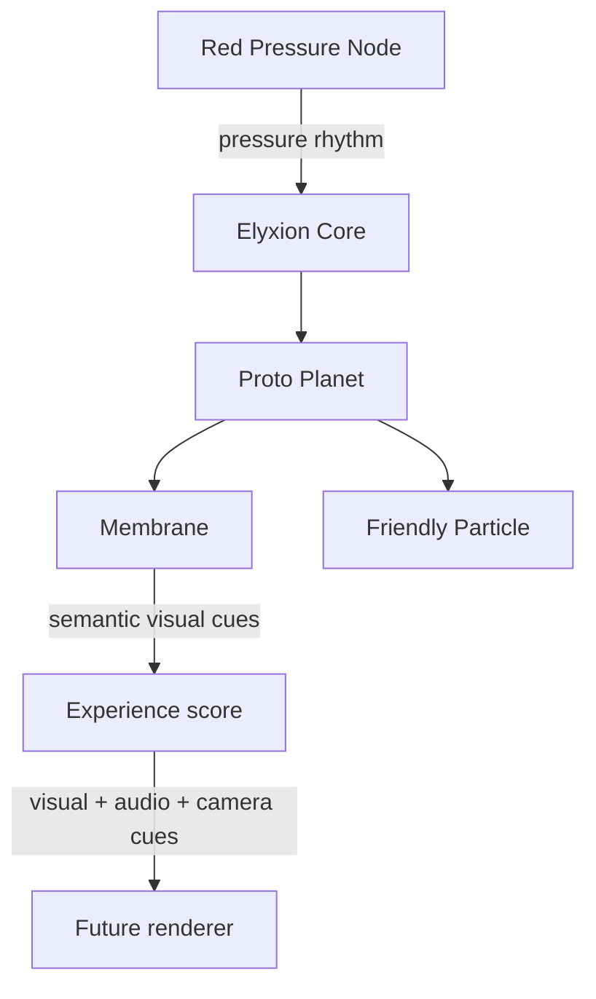

# Elyxion

Elyxion is an emotional-visual evolutionary game universe. Its long arc moves
from cell to organism, pack, tribe, civilization, and eventually cosmos.

The creator-stated Phase 1 causal spine is:

`manual rhythm -> intake -> mixed particles -> overload -> recovery -> delayed friendly activation -> partial automation -> Phase 2`

Read the [Phase 1 canon map](docs/canon/phase-1-canon-map.md) before treating a
prototype constant or authored scene as canon.



The repository currently contains two deliberately separate working layers:

- `USER_APPROVED_PROTOTYPE_RULE`: the playable Friendly Points TASK 001;
- `EXPERIMENTAL_CANDIDATE`: a deterministic Red/Crimson Pressure Node
  first-contact simulation and presentation score.

The experiment preserves useful visual direction, but its fixed topology,
numbers, timing, and phase placement do not define Phase 1 canon.

## Experimental first-contact scope

- deterministic simulation time and encounter history;
- one proto planet at the `cell` evolutionary stage;
- membrane integrity, energy, automatic response, and recovery;
- one friendly particle moving from `dormant` to `recognizing` to `supporting`;
- one candidate Red Pressure Node with a repeatable pressure rhythm;
- engine-independent visual cues for deformation, ripple, desaturation, and
  particle activation;
- a deterministic 31-second presentation score for synchronized visual, audio,
  and camera direction;
- no dependency on a game engine, UI, database, or network.

WhiteLine is a separate standalone project. Elyxion does not contain WhiteLine
scores, tiers, or learning rules. Any future connection must be made through an
external adapter without making either project a module of the other.

## Run locally

Requires Node.js 20 or newer.

```bash
npm install
npm test
npm run simulate
npm run experience
```

## Friendly Points prototype (TASK 001)

Run the smallest playable browser scene:

```bash
npm start
```

Then open `http://localhost:4173` and click each visible Friendly Point to move
it into the membrane. The debug readout shows the absorbed count, membrane
scale, and breathing interval. This isolated prototype implements only these
rules:

- scale starts at `2.0`;
- point 3 changes scale to `3.0`;
- point 5 changes scale to `5.0` and breathing from `2s` to `3s`.

It does not load enemies, damage, online features, or other gameplay systems.

## Repository map

```text
docs/                         vision, architecture, roadmap, glossary, decisions
src/core/                     contracts and deterministic orchestration
src/world/                    proto-planet aggregate
src/membrane/                 integrity, energy, and pressure response
src/particles/                friendly internal particle
src/presentation/             visual-audio-camera score derived from outcomes
src/threats/red-pressure-node experimental pressure-source candidate
src/simulation/               executable first-contact experiment
tests/unit/                   isolated rules
tests/scenarios/              complete world loops
```

Start with the [canon map](docs/canon/phase-1-canon-map.md) and
[research boundary](docs/research/phase-1-evidence-notes.md). Then read the
[vision](docs/vision.md), [experimental architecture](docs/architecture.md),
[first-contact candidate](docs/first-contact-experience.md), and
[roadmap](docs/roadmap.md).
