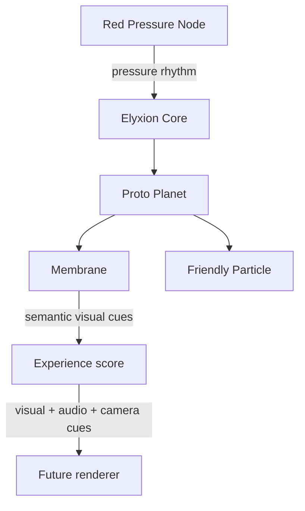

# Elyxion

Elyxion is an emotional-visual evolutionary game universe. Its long arc moves
from cell to organism, pack, tribe, civilization, and eventually cosmos.

Phase 1 begins with the smallest living scene:

`1 planet -> 1 membrane -> 1 friendly particle -> 1 enemy node`



The canonical first contact is a fragile membrane in a dark, ancient aquatic
environment. A translucent crimson Red Pressure Node, recognizable by three
internal cores, strikes from outside. One muted green internal particle wakes,
begins recognizing danger, and forms only a subtle stabilizing connection. It
does not create a complete shield in Phase 1.

## Current scope

- deterministic simulation time and encounter history;
- one proto planet at the `cell` evolutionary stage;
- membrane integrity, energy, automatic response, and recovery;
- one friendly particle moving from `dormant` to `recognizing` to `supporting`;
- one canonical Red Pressure Node with a repeatable pressure rhythm;
- engine-independent visual cues for deformation, ripple, desaturation, and
  particle activation;
- a deterministic 31-second presentation score for synchronized visual, audio,
  and camera direction;
- no dependency on a game engine, UI, database, or network.

WhiteLine is a separate standalone project. Elyxion does not contain WhiteLine
scores, tiers, or learning rules. Any future connection must be made through an
external adapter without making either project a module of the other.

## Run locally

Requires Node.js 20 or newer.

```bash
npm install
npm test
npm run simulate
npm run experience
```

## Repository map

```text
docs/                         vision, architecture, roadmap, glossary, decisions
src/core/                     contracts and deterministic orchestration
src/world/                    proto-planet aggregate
src/membrane/                 integrity, energy, and pressure response
src/particles/                friendly internal particle
src/presentation/             visual-audio-camera score derived from outcomes
src/threats/red-pressure-node canonical Phase 1 enemy
src/simulation/               executable first-contact scenario
tests/unit/                   isolated rules
tests/scenarios/              complete world loops
```

Start with [the vision](docs/vision.md), then read
[the architecture](docs/architecture.md), the
[first-contact experience](docs/first-contact-experience.md), and the
[roadmap](docs/roadmap.md).
