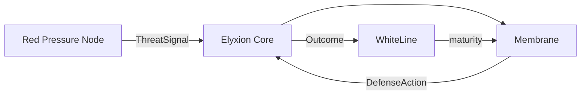

# Elyxion

Elyxion is an engine-agnostic simulation core for a system that detects pressure,
responds automatically, survives the outcome, and learns from it.

Phase 1 focuses on one complete loop:



`pressure -> signal -> evaluation -> defense -> outcome -> learning`

## Current scope

- deterministic simulation clock and event history;
- automatic Membrane response (`stable`, `alert`, `defense`, `recovery`);
- WhiteLine maturity score from 0 to 100 with tiers M0-M3;
- canonical Red Pressure Node threat generator;
- first-contact scenario and executable tests;
- no dependency on a game engine, UI, database, or network.

The maturity thresholds and defense balance are provisional Phase 1 values. They
are centralized in the WhiteLine and Membrane modules so the model can evolve
without changing its contracts.

## Run locally

Requires Node.js 20 or newer.

```bash
npm install
npm test
npm run simulate
```

## Repository map

```text
docs/                         vision, glossary, architecture, decisions
src/core/                     contracts and orchestration
src/membrane/                 threat evaluation and automatic defense
src/whiteline/                maturity and learning
src/threats/red-pressure-node canonical Phase 1 threat
src/simulation/               executable scenarios
tests/unit/                   isolated rules
tests/scenarios/              complete system loops
```

Start with [the vision](docs/vision.md), then read
[the architecture](docs/architecture.md) and [the glossary](docs/glossary.md).

