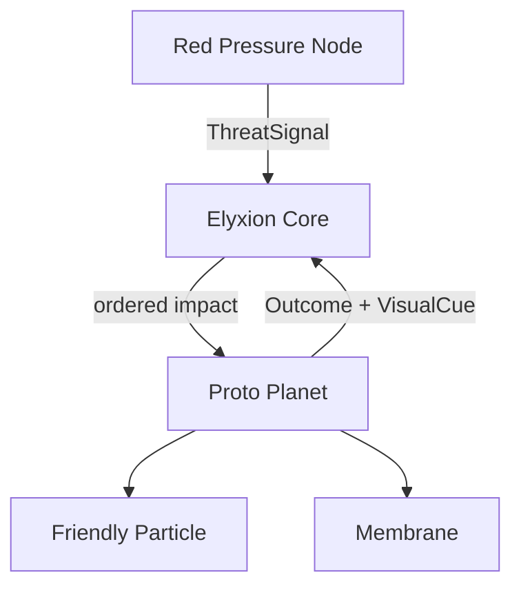

# Architecture

Elyxion Phase 1 is a deterministic domain core that emits semantic visual cues.
It owns game rules but not rendering. Dependencies point inward toward shared
contracts; no entity reaches into another entity's private state.

## System roles

| System | Phase 1 responsibility |
| --- | --- |
| Elyxion Core | Owns simulation time, order, fixed MVP topology, and immutable history. |
| Proto Planet | Owns the membrane and the single friendly particle at the `cell` stage. |
| Membrane | Converts pressure and weak friendly support into mitigation, damage, energy cost, and visual response. |
| Friendly Particle | Begins dormant, recognizes repeated pressure, then provides subtle support. |
| Red Pressure Node | Emits a deterministic rhythm while preserving its three-core identity. |
| Future renderer | Translates semantic cues into animation, sound, particles, lighting, and camera behavior. |

## Resolution order

For every threat signal, the Core completes one transaction:

1. Validate that the signal tick moves time forward.
2. Snapshot the proto planet before impact.
3. Let the friendly particle observe the pressure.
4. Resolve the membrane response using only support already learned before the
   current impact; recognition never becomes an instant shield.
5. Apply energy cost and integrity damage.
6. Emit semantic visual cues for ripple, deformation, brief desaturation, and
   particle-state transitions.
7. Move an activated membrane into recovery.
8. Append one immutable encounter outcome to history.

This order is part of the architecture. A renderer may observe it but may not
reorder or partially apply it.

## Contracts

Shared contracts live in `src/core/contracts.ts`:

- `ThreatSignal` is immutable input from a threat producer.
- `FriendlyParticleObservation` records recognition and support without hiding
  the previous state.
- `DefenseAction` is the membrane's automatic choice.
- `EncounterOutcome` records pressure, mitigation, damage, before/after world
  state, and visual cues.
- `CoreSnapshot` exposes the Phase 1 topology and read-only world state.
- `VisualCue` describes what happened semantically; timing curves, sprites,
  shaders, and audio remain renderer concerns.

## Invariants

- Threat intensity, membrane integrity, and membrane energy stay within 0-100.
- Signal ticks strictly increase within a Core instance.
- Prevented pressure plus residual pressure equals incoming intensity.
- One signal produces exactly one response and one immutable outcome.
- The friendly particle cannot provide support on the impact that first wakes it.
- Phase 1 support is capped and cannot become a complete shield.
- The world contains exactly one proto planet, one membrane, one friendly
  particle, and one enemy node.
- Given the same initial world and signal sequence, the result is identical.

## External project boundary

WhiteLine scores and M0-M3 tiers do not belong to this core. If Elyxion and
WhiteLine are connected later, an adapter outside both domain cores may exchange
explicit events. Elyxion gameplay, adaptation, and progression may never depend
on WhiteLine being available.
