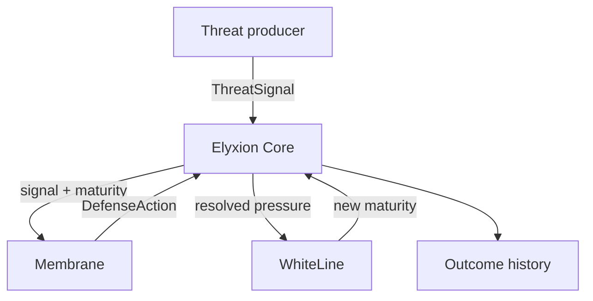

# Architecture

Elyxion Phase 1 uses a deterministic, event-driven domain core. Dependencies
point inward toward shared contracts; no module reaches into another module's
private state.

## Resolution order

For every signal, the Core performs one transaction:

1. Validate that the signal tick moves time forward.
2. Snapshot WhiteLine maturity.
3. Ask the Membrane for an automatic response.
4. Resolve prevented pressure, residual pressure, and defense cost.
5. Feed the resolved values to WhiteLine learning.
6. Append one complete outcome to history.
7. Move an activated Membrane into recovery.

This order is part of the architecture. Visual effects may observe it, but may
not reorder or partially apply it.

## Contracts

Shared contracts live in `src/core/contracts.ts`:

- `ThreatSignal` is input from any future threat producer.
- `DefenseAction` is the Membrane's decision.
- `EncounterOutcome` is the durable result consumed by history and UI layers.
- `CoreSnapshot` exposes read-only system state without leaking module internals.

The Red Pressure Node knows only how to emit `ThreatSignal`. It has no reference
to Elyxion Core, Membrane, or WhiteLine. This prevents enemies from bypassing the
system's causal loop.

## Invariants

- Signal intensity and WhiteLine score remain in the inclusive range 0-100.
- Signal ticks strictly increase within a Core instance.
- Prevention plus residual pressure equals incoming intensity.
- Outcome history is append-only from the public API.
- One signal produces exactly one defense action and one outcome.
- Given the same initial score and signal sequence, the result is identical.

## Extension points

New threats implement the same signal contract. A renderer can subscribe to
returned outcomes or snapshots. Persistence can serialize outcome history.
Balance changes remain internal to Membrane and WhiteLine until a dedicated
configuration contract is justified.

