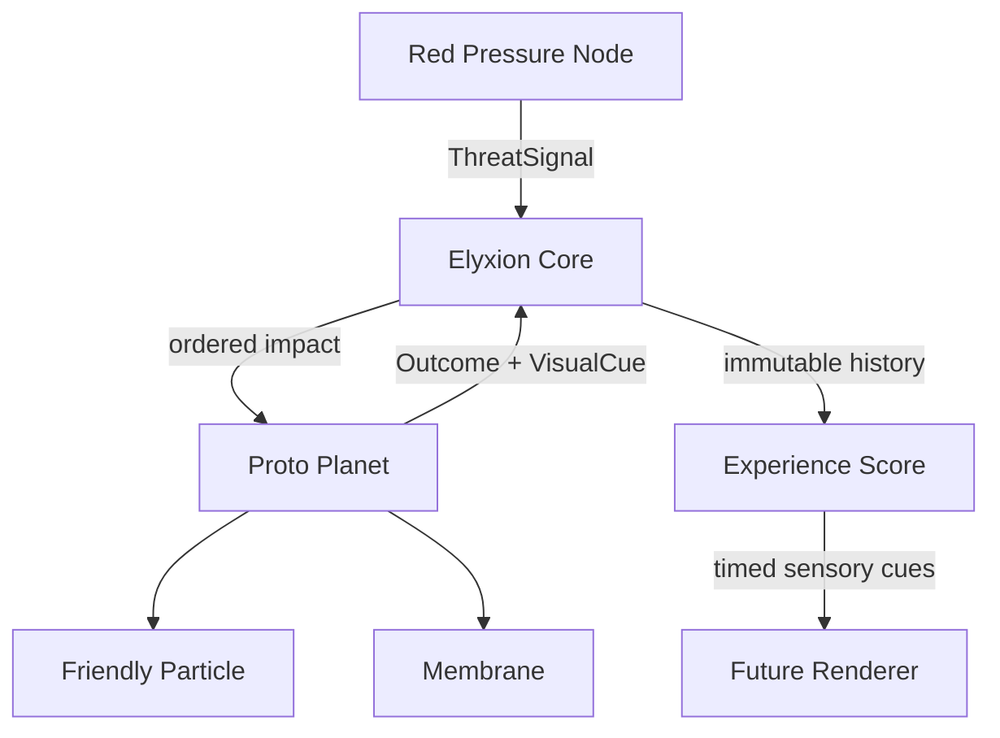

# Experimental first-contact architecture

- Status: EXPERIMENTAL_CANDIDATE
- Canon authority: none

This architecture is a reversible reference experiment. It does not replace the
creator-stated Phase 1 causal spine in
[`docs/canon/phase-1-canon-map.md`](canon/phase-1-canon-map.md). In particular,
its fixed one-particle topology, automatic defense loop, response states, and
numeric thresholds are not accepted Phase 1 canon.

Elyxion Phase 1 is a deterministic domain core that emits semantic visual cues.
It owns game rules but not rendering. Dependencies point inward toward shared
contracts; no entity reaches into another entity's private state.

## System roles

| System | Phase 1 responsibility |
| --- | --- |
| Elyxion Core | Owns simulation time, order, fixed MVP topology, and immutable history. |
| Proto Planet | Owns the membrane and the single friendly particle at the `cell` stage. |
| Membrane | Converts pressure and weak friendly support into mitigation, damage, energy cost, and visual response. |
| Friendly Particle | Begins dormant, recognizes repeated pressure, then provides subtle support. |
| Red Pressure Node | Emits a deterministic rhythm while preserving its three-core identity. |
| Experience Score | Converts immutable outcomes into ordered visual, audio, and camera cues without changing game state. |
| Future renderer | Maps presentation cues to animation, sound, particles, lighting, and camera APIs. |

## Resolution order

For every threat signal, the Core completes one transaction:

1. Validate that the signal tick moves time forward.
2. Snapshot the proto planet before impact.
3. Let the friendly particle observe the pressure.
4. Resolve the membrane response using only support already learned before the
   current impact; recognition never becomes an instant shield.
5. Apply energy cost and integrity damage.
6. Emit semantic visual cues for ripple, deformation, brief desaturation, and
   particle-state transitions.
7. Move an activated membrane into recovery.
8. Append one immutable encounter outcome to history.

This order is part of the architecture. A renderer may observe it but may not
reorder or partially apply it.

## Contracts

Shared contracts live in `src/core/contracts.ts`:

- `ThreatSignal` is immutable input from a threat producer.
- `FriendlyParticleObservation` records recognition and support without hiding
  the previous state.
- `DefenseAction` is the membrane's automatic choice.
- `EncounterOutcome` records pressure, mitigation, damage, before/after world
  state, and visual cues.
- `CoreSnapshot` exposes the Phase 1 topology and read-only world state.
- `VisualCue` describes what happened semantically; timing curves, sprites,
  and shaders remain outside the domain core.
- `FirstContactExperience` is a deterministic presentation score with seven
  emotional beats and normalized timed cues.
- `ExperienceCue` identifies modality, target, strength, timing, and the source
  signal while remaining independent of engine assets and APIs.

## Presentation boundary

The domain core answers **what happened**. The presentation score answers
**when and through which senses it should be expressed**. A renderer answers
**which concrete asset or engine API performs it**.

The current candidate first-contact score lasts 31 seconds. It adds ambience, threat
arrival, impact audio, local camera impulses, particle tones, and recovery
rhythm around the domain's visual cues. It may amplify clarity but may not invent
mitigation, damage, recognition, or support that is absent from the outcome.

See `docs/first-contact-experience.md` for the authored timeline and sensory
language.

## Experimental invariants

- Threat intensity, membrane integrity, and membrane energy stay within 0-100.
- Signal ticks strictly increase within a Core instance.
- Prevented pressure plus residual pressure equals incoming intensity.
- One signal produces exactly one response and one immutable outcome.
- The friendly particle cannot provide support on the impact that first wakes it.
- Phase 1 support is capped and cannot become a complete shield.
- This experiment contains exactly one proto planet, one membrane, one friendly
  particle, and one enemy node; that topology is not a canon constraint.
- Given the same initial world and signal sequence, the result is identical.
- Given the same encounter history, the ordered presentation score is identical.
- Presentation cue strengths stay within 0-1 and cue timing stays inside the
  31-second experience.

## External project boundary

WhiteLine scores and M0-M3 tiers do not belong to this core. If Elyxion and
WhiteLine are connected later, an adapter outside both domain cores may exchange
explicit events. Elyxion gameplay, adaptation, and progression may never depend
on WhiteLine being available.
